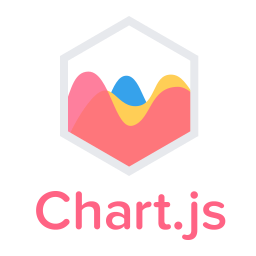

<p align="center">
  
</p>

**Présentation et démonstration de la librairie Javascript [Chart.js](https://www.chartjs.org/), dans le cadre du cours de clean-code.**

## Présentation

Pour voir la présentation, suivre :

```bash
git clone git@github.com:p0lycarpio/chartJSCleanCode.git
cd chartJSCleanCode
npm install
```
Lancer la page web avec `npm start`. Se rendre  sur [localhost:8000](http://localhost:8000).

### Chart.js

* [Exemples présentés en cours](/exemples)
* [Documentation](https://www.chartjs.org/docs/)
* [Github du projet](https://github.com/chartjs/Chart.js)
